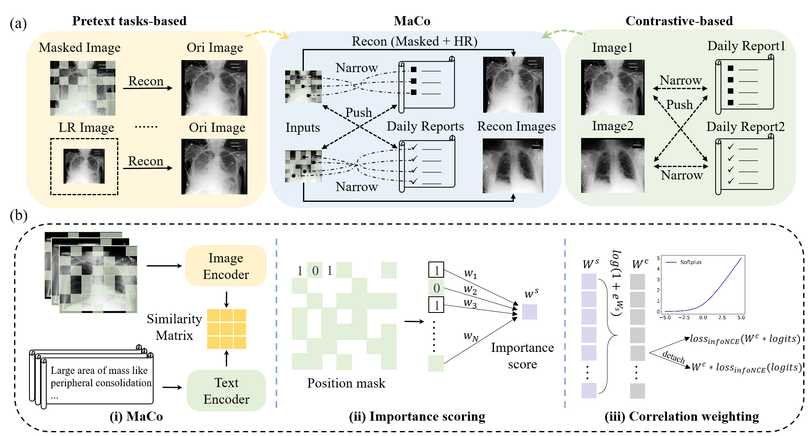

# MaCo

<!-- Insert the project banner here -->



## Key Features

This repository provides the official implementation of "Enhancing Representation in Radiography-Reports Foundation Model: A Granular Alignment Algorithm Using Masked Contrastive Learning"

In this study, we present MaCo, a masked contrastive chest X-ray foundation model that tackles these challenges. MaCo explores masked contrastive learning to simultaneously achieve fine-grained image understanding and zero-shot learning for a variety of medical imaging tasks. It designs a correlation weighting mechanism to adjust the correlation between masked chest X-ray image patches and their corresponding reports, thereby enhancing the model's representation learning capabilities. To evaluate the performance of MaCo, we conducted extensive experiments using 6 well-known open-source X-ray datasets. 

## Links

- [Paper](https://arxiv.org/abs/2309.05904)

## Dataset Links

- [MIMIC-CXR v2](https://physionet.org/content/mimic-cxr-jpg/2.0.0/)
- [CheXpert](https://stanfordmlgroup.github.io/competitions/chexpert/) 
- [NIH](https://www.kaggle.com/datasets/nih-chest-xrays/data)
- [COVID Rural](https://github.com/ieee8023/covid-chestxray-dataset)
- [SIIM](https://www.kaggle.com/c/siim-acr-pneumothorax-segmentation)
- [RSNA](https://www.kaggle.com/c/rsna-pneumonia-detection-challenge/data)
- [MS-CXR](https://physionet.org/content/ms-cxr/0.1/)

## Model Links
- [MAE](https://drive.google.com/file/d/1LZwbPUKmQum5fYDWbJ7iVXdrYFNtff3X/view?usp=sharing)
- [MaCo](https://drive.google.com/file/d/1B87JuLJnjh_CoQpjT7RWGTp6alfXV8_0/view?usp=sharing)
  
## Get Started


## Preprocess
1. To install the required environment packages, please use the following code. It is recommended to install them in a new conda virtual environment:
```bash
pip install -r requirements.txt
```

2. Download the models, including the MAE weights used in the pre-training phase and the well-trained MaCo model for validating downstream tasks.

3. Download all datasets according to the "Dataset Links" and split them into training, validation, and test sets based on the "DatasetsSplits".

4. Please replace all instances of "path/to/.." in the code with the specific paths to your files.


## Pre-training
```bash
CUDA_VISIBLE_DEVICES=0,1,2,3 torchrun --nproc_per_node=4 --master_port=29501 main_pretrain.py --SR 1 --mask_ratio 0.5 --lam 0.9 --T 0.03 --warmup_epochs 2 --batch_size 512 --epochs 51 --lr 2.5e-4 --prefix maco
```

## Fine-tuning Classification
We provide a classification example based on the NIH dataset, including training with 1%, 10%, and 100% of the annotated data, along with the corresponding evaluation process:
```bash
cd ./CLS-NIH_ChestX-ray/
CUDA_VISIBLE_DEVICES=1 python train.py --pretrained_path /path/to/model/maco/maco.pth  --data_volume '1'   --learning_rate 8.5e-3; python test.py --model maco --gpu 1;
CUDA_VISIBLE_DEVICES=1 python train.py --pretrained_path /path/to/model/maco/maco.pth  --data_volume '10'  --num_steps 30000 --learning_rate 3e-3 --warmup_steps 500; python test.py --model maco --gpu 1;
CUDA_VISIBLE_DEVICES=1 python train.py --pretrained_path /path/to/model/maco/maco.pth  --data_volume '100' --num_steps 200000 --learning_rate 3e-3 --warmup_steps 5000;python test.py --model maco --gpu 1;
```

To streamline the classification process, we have included additional script files. By simply entering the necessary information, you can easily generate execution code for all three datasets.
```bash
python train_finetune_terminal_all.py
```

## Fine-tuning Segmentation
We conduct all segmentation experiments using [MMSegmentaiton](https://github.com/open-mmlab/mmsegmentation) (version 0.25.0). We recommend that readers set up the environment in advance and familiarize themselves with the code structure of MMSegmentation.

The necessary configuration files are provided in the "SIIM_Seg" directory. After integrating these files into the MMSegmentation framework, you can start fine-tuning using ft.sh and evaluation using test.sh.
```bash
./ft.sh
./test.sh
```

## Fine-tuning Detection
We implement the detection task using [ViTDet](https://github.com/facebookresearch/detectron2/tree/main/projects/ViTDet). We recommend that readers set up the environment in advance and familiarize themselves with the code structure of ViTDet.
The necessary configuration files are provided in the "detectron2" directory. 
```bash
 cd ./detectron2/projects/ViTDet
../../tools/lazyconfig_train_net_rsna.py train.init_checkpoint=path/to/maco.pth
```
## Zero-shot classification
```bash
python Zeroshot Classification.py --pretrained_path "/path/to/maco.pth" --dataset_list ["NIH", "RSNA", "SIIM"]
```
## Zero-shot Phrase-grounding
```bash
python Phrase Grounding --ckpt_dir "/path/to/maco.pth"
```


## 🙏 Acknowledgement

Some code is borrowed from [MAE](https://github.com/facebookresearch/mae), [MedKlip](https://github.com/MediaBrain-SJTU/MedKLIP), [HI-ML](https://hi-ml.readthedocs.io/en/latest/multimodal.html), and [MRM](https://github.com/RL4M/MRM-pytorch)

## 📝 Citation

If you find this repository useful, please consider citing this paper:
```
@article{huang2023enhancing,
  title={Enhancing representation in radiography-reports foundation model: A granular alignment algorithm using masked contrastive learning},
  author={Weijian Huang, Cheng Li, Hong-Yu Zhou, Hao Yang, Jiarun Liu, Yong Liang, Hairong Zheng, Shaoting Zhang, Shanshan Wang},
  journal={arXiv preprint arXiv:2309.05904},
  year={2023}
}
```

